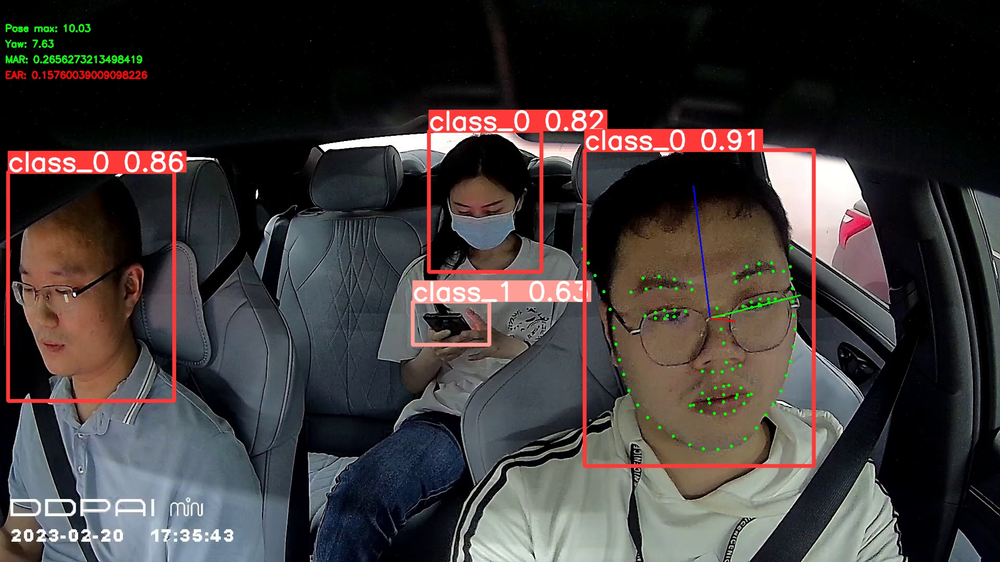
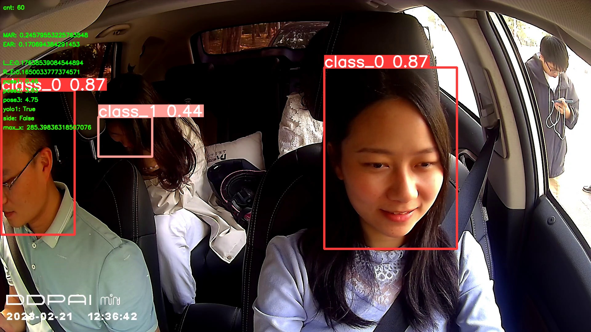

# fatigue-driving-detection

挑战杯2023华为产业赛道的命题：**疲劳驾驶识别**

涉及的知识栈包括：人脸检测，面部关键点识别，序列判断。

---

## 涉及模型说明

对于关键模型，我们做了以下尝试：

1. YOLOv5 + Dlib
2. YOLOv5 + SPIGA
3. YOLOv7 + SPIGA
4. **YOLOv7 + Renita（baseline）**
5. YOLOv8 + SPIGA
6. **YOLOv8 + Renita （last submit）**
    
    ---
    

## 调参体验

- **YOLOv5s** 的模型在识别**精准度**和**速度**上都稍逊于 **YOLOv8n**
  
- **YOLOv7** 的模型在**训练时间**上要比v8的相似参数模型长数倍

- **SPIGA** 是人脸关键点检测的一个SOTA模型，但显然SOTA的是大数据集上的**准确率**，而非**准确率/性能。**其单帧平均推理速度在官方要求的硬件（2核8GB的老式cpu）中达到了惊人的 ***1.404s per** **frame**(*😓)。最后因其糟糕的边缘部署能力而被淘汰。
> 仅供参考，在640 x 640下
> 
> YOLOv8：230ms per frame
> 
>  Renita：56ms per frame
> 
- **Renita** 是官方Baseline提供的模型参考，也是我们最后选用的模型。此模型在遮挡和光照条件并不复杂的车内环境表现良好。
  💡 作为参考，在官方硬件下的单平均帧推理速度：

---

## 文件指引

BaselineLandmark/detectionx.2 ： 最后一次提交

submit/detection8：YOLOv8 + SPIGA的最后一版

BaselineLandmark/makeup ： Retina + YOLOv8的调试脚本

---

## 琐事

**为什么主程序的主要代码都是一坨？你完全不封装吗？**

- 为什么其中主程序为了与贴近baseline的提交格式，且便于调优，并没有作封装处理。*（虽然结构几乎一致，但主程序在编写时完全没有参考baseline，以至于最开始作移植的同学挠破了头）*
- 并且整个项目都是**单人编程**和**线性作业**，每个人的分工区域足够清晰，因此并不需要考虑别人能不能读懂，大家都**没那个时间和精力**~~除了我以外根本没人读~~。

> 最好的分工即 一个人的工作足够涉及这部分工作所有的方面。
> 

**成绩如何？**

比赛通过对F1-Score（精准率）与速度进行统一衡量。在人脸关键点部分，通过运用序列的模式识别，我们已经做到了**应检尽检。**

**比赛的难点有哪些？**

- 数据集的大小有点夸张了（2066 * 8s 的视频序列）
- 华为云ModelArts的在线部署功能（打榜需要通过此方法提交）的文档应缺尽缺，主打一个什么都没有。选手在稳定提交之前还要先逆向工程出其运作流程 😓
